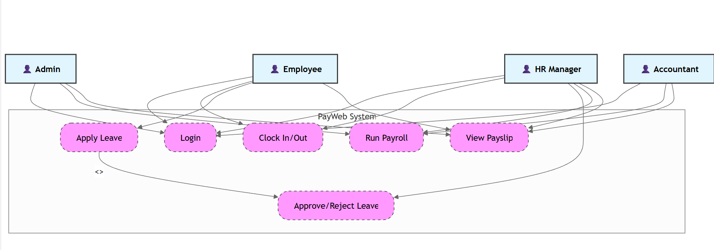

# employee-payroll-systememployee-payroll-system/
│
├── frontend/               # React frontend
│   ├── public/             # Static files (index.html, favicon)
│   ├── src/
│   │   ├── assets/         # Images, icons, styles
│   │   ├── components/     # Reusable UI components (Navbar, Sidebar, Cards)
│   │   ├── pages/          # Page-level views (Dashboard, Profile, Payments)
│   │   ├── services/       # API calls (axios setup)
│   │   ├── context/        # Auth and global state
│   │   ├── utils/          # Helper functions
│   │   └── App.js          # Main app entry
│   └── package.json
│
├── backend/                # Node.js + Express backend
│   ├── controllers/        # Business logic (employee, admin, payroll)
│   ├── models/             # Mongoose or Sequelize schemas
│   ├── routes/             # API endpoints
│   ├── middleware/         # Auth, role-based access
│   ├── config/             # DB connection, environment setup
│   ├── utils/              # Payroll calculator, invoice generator
│   └── server.js           # Main server entry
│
├── .env                    # Environment variables
├── README.md               # Project overview
├── docs/                   # Diagrams, thesis notes, screenshots
│   ├── architecture/
│   ├── wireframes/
│   └── thesis-outline.docx
├── database/               # SQL scripts or Mongo seed files
│   └── schema.sql
├── logs/                   # Server logs (optional)
└── package.json            # Root-level (optional if separate frontend/backend installs)

